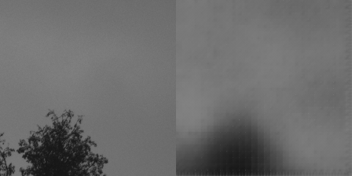

# Expriment on Conlutional Autoencoder for Raw Bayer Images

## Dataset
[the PyNet Project](http://people.ee.ethz.ch/~ihnatova/pynet.html) provides a raw image dataset, but it is targeted to NN isp.

## Results

